注意：请不要跳过这段话。

开发环境是开发人员在开发过程当中，所需的软硬件平台。开发环境并不是一个固定的样式，前文中，我们详细讲解一个嵌入式Linux开发环境搭建的方法。您已经对嵌入式开发非常了解的话，可以按照自己的需求来搭建环境。如果遇到一些使用上的问题，您可以从国内一些大Linux论坛和网站搜索相关的信息来解决。本章节提到的操作是在我们提供的开发环境上进行的，经过飞凌的测试，如果对嵌入式开发不是非常熟悉的朋友，建议您使用我们提供的环境。**我们开发环境的普通用户为：forlinx，密码为：forlinx，超级用户为：root，密码为root。**

## <font style="color:black;">4.1</font><font style="color:black;">  </font><font style="color:black;">编译前的准备</font>
### <font style="color:black;">4.1.1</font><font style="color:black;">  </font><font style="color:black;">版本说明</font>
Ø  虚拟机软件：Vmware15.1.0

Ø  建议开发环境操作系统：Ubuntu20.04 64 位版

Ø  交叉工具链：gcc-arm-10.3-2021.07-x86_64-aarch64-none-linux-gnu（内核）

```plain
aarch64-buildroot-linux-gnu_sdk-buildroot（应用）
```

Ø  Bootloader 版本：u-boot-2018.07

Ø  内核版本：linux-5.15.147

Ø  开发板QT版本：qt5.15.8

### <font style="color:black;">4.1.2</font><font style="color:black;">  </font><font style="color:black;">源码</font><font style="color:black;">拷贝和释放</font>
内核源码路径：用户资料\软件资料\2-镜像及源码\1-源码\OKT527-linux-sdk1.3.tar.bz2.**

1、源码拷贝

飞凌OKT527-linux-sdk1.3.tar.bz2包括工具链、用户sdk、Linux内核、文件系统、测试程序源码以及一些工具等。

```plain
forlinx@ubuntu:~$ mkdir /home/forlinx/work                                            //创建工作路径
```

拷贝源码包到虚拟机 /home/forlinx/work 目录。

可以直接将电脑上的源码包直接拖拽到虚拟机桌面的文件夹中，或者利用共享文件夹使用命令拷贝，这里着重介绍共享文件夹的使用。

ubuntu和Windows主机之间的文件传输有很多种，安装VMware Tools后，可以设置虚拟机共享文件夹，将Windows主机的文件目录挂载到ubuntu中，实现文件共享。

设置方法如下，点击菜单栏的“虚拟机”，选择“设置”。

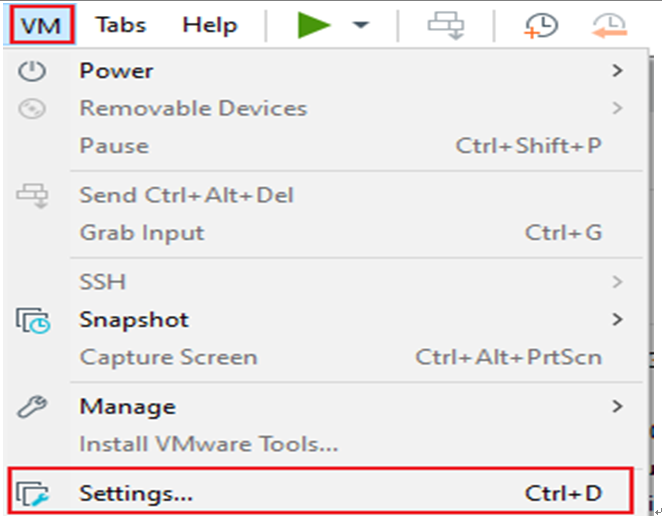

点击“选项”，启用“共享文件夹”，设置Windows主机上的共享目录，点击“确定”。

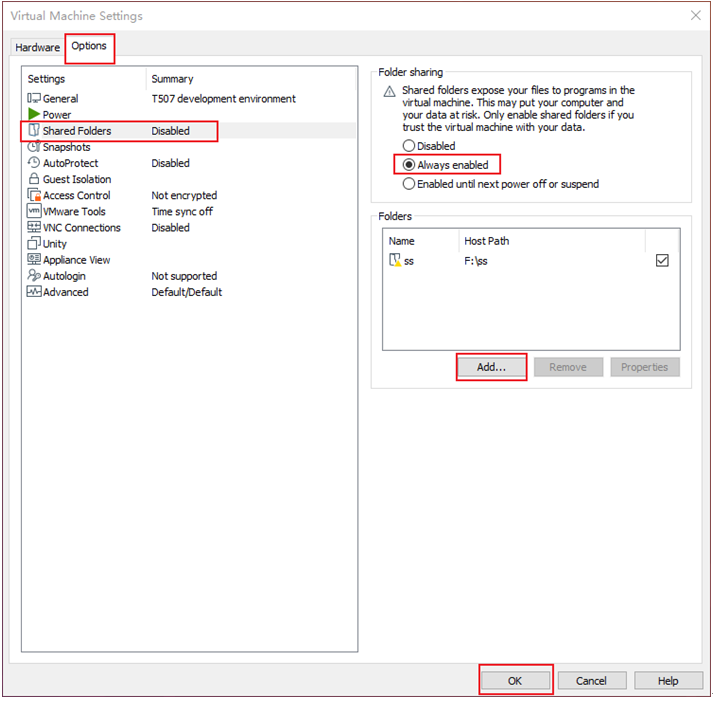

虚拟机的文件共享设置完成后，将源码包OKT527-linux-sdk1.3.tar.bz2放到Windows主机的共享文件夹中，这里我们命名为share。

共享文件夹在ubuntu中的挂载目录/mnt/hgfs/share，查看挂载目录下文件。

```plain
forlinx@ubuntu:~$ ls /mnt/hgfs/share/                                //查看共享目录内文件
OKT527-linux-sdk1.3.tar.bz2
```

将共享文件夹中的源码拷贝到ubuntu的/home/forlinx/work目录下，进行md5校验：

```plain
forlinx@ubuntu:~$ cp /mnt/hgfs/share/OKT527-linux-sdk1.3.tar.bz2.* /home/forlinx/work/       
forlinx@ubuntu:~$ cd /home/forlinx/work
forlinx@ubuntu:~/work$ md5sum OKT527-linux-sdk1.3.tar.bz2.*
```

返回的md5校验码与资料中的校验码一致，即可解压源码：

```plain
forlinx@ubuntu:~/work$ cat OKT527-linux-sdk1.3.tar.bz2.0* | tar jxv
```

### <font style="color:black;">4.1.3</font><font style="color:black;">  </font><font style="color:black;">源码常见文件路径</font>
OK527-C平台，软件配置文件路径（SDK源码OKT527-linux-sdk路径下开始）如下：

| 文件类型 | 路径 |
| --- | --- |
| 内核配置文件 | device/config/chips/t527/configs/okt527/linux-5.15/bsp_defconfig |
| 设备树文件 | kernel/linux-5.15/bsp/configs/linux-5.15/sun55iw3p1.dtsi |
|  | kernel/linux-5.15/arch/arm64/boot/dts/allwinner/OKT527-C-Common.dtsi |
|  | kernel/linux-5.15/arch/arm64/boot/dts/allwinner/OKT527-C-Linux.dts |
| sysconfig.fex | device/config/chips/t527/configs/okt527/sys_config.fex |
| 文件系统源文件 | 文件添加路径<br/>buildroot/buildroot-202205/board/forlinx/okt527/fs-overlay/<br/>最终打包路径<br/>out/t527/okt527/buildroot/buildroot/target    |
| uboot环境变量设置文件 | device/config/chips/t527/configs/okt527/buildroot/env.cfg   如果需要修改或者添加默认的环境变量，可修改该文件。 |


OK527-C平台，测试程序路径（SDK源码OKT527-linux-sdk路径下开始）如下：

Ø    platform/framework/auto/cmd_demo     命令行测试程序源码目录

Ø    platform/framework/auto/qt_demo       Qt测试程序源码目录

|  |  | 源码路径 |
| --- | --- | --- |
| qt-demo | 4G | platform/forlinx/forlinx_qt_demo/4g |
|  | ADC | platform/forlinx/forlinx_qt_demo/adc |
|  | 背光 | platform/forlinx/forlinx_qt_demo/backlight |
|  | SQL | platform/forlinx/forlinx_qt_demo/books |
|  | 浏览器 | platform/forlinx/forlinx_qt_demo/browser |
|  | camera测试 | platform/forlinx/forlinx_qt_demo/camera |
|  | 录音 | platform/forlinx/forlinx_qt_demo/fltest_qt_audiorecorder |
|  | 音频播放 | platform/forlinx/forlinx_qt_demo/fltest_qt_musicplayer |
|  | 按键测试 | platform/forlinx/forlinx_qt_demo/keypad |
|  | 桌面 | platform/forlinx/forlinx_qt_demo/matrix-browser |
|  | 网络配置 | platform/forlinx/forlinx_qt_demo/network |
|  | ping | platform/forlinx/forlinx_qt_demo/ping_test |
|  |  | platform/forlinx/forlinx_qt_demo/qopenglwidget |
|  | rtc | platform/forlinx/forlinx_qt_demo/rtc |
|  | Spi | platform/forlinx/forlinx_qt_demo/spitest |
|  | 串口测试 | platform/forlinx/forlinx_qt_demo/terminal |
|  | 看门狗 | platform/forlinx/forlinx_qt_demo/watchdog |
|  | WiFi | platform/forlinx/forlinx_qt_demo/wifi |
| cmd-demo | 视频硬解码 | platform/forlinx/forlinx_cmd_demo/decoderTest |
|  | 视频硬编码 | platform/forlinx/forlinx_cmd_demo/encoder_test |
|  | 清屏 | platform/forlinx/forlinx_cmd_demo/fbinit_test |
|  | GPADC | platform/forlinx/forlinx_cmd_demo/fltest_adc |
|  | 背光 | platform/forlinx/forlinx_cmd_demo/fltest_backlight |
|  | 按键测试 | platform/forlinx/forlinx_cmd_demo/fltest_keytest |
|  | SPI测试 | platform/forlinx/forlinx_cmd_demo/fltest_spidev_test |
|  | UART | platform/forlinx/forlinx_cmd_demo/fltest_uarttest |
|  | USB摄像头 | platform/forlinx/forlinx_cmd_demo/fltest_usbcam |
|  | 看门狗 | platform/forlinx/forlinx_cmd_demo/fltest_watchdog |
|  | ec20 4G | platform/forlinx/forlinx_cmd_demo/quectelCM |
|  | wifi | platform/forlinx/overlay_rootfs/usr/bin/fltest_wifi.sh |
|  | Wifi-ap | platform/forlinx/overlay_rootfs/usr/bin/fltest_hostap.sh |
|  | gpio | platform/forlinx/overlay_rootfs/usr/bin/fltest_gpio.sh |
|  | 桌面 | platform/forlinx/overlay_rootfs/etc/init.d/S60Matrix_Browser |


## <font style="color:black;">4.2</font><font style="color:black;">  </font><font style="color:black;">源码编译</font>
### <font style="color:black;">4.2.1</font><font style="color:black;">  </font><font style="color:black;">全编译</font>
全编译是指对源码的统一编译，包括内核源码、库文件、应用、文件系统打包等。

首先选择配置：

```plain
forlinx@ubuntu:~$ cd /home/forlinx/work/OKT527-linux-sdk                    //进入源码路径
forlinx@ubuntu:~/work/OKT527-linux-sdk$ ./build.sh config                    //执行配置命令
```

```plain
forlinx@ubuntu:~/work/OKT527-linux-sdk$ ./build.sh config
========ACTION List: mk_config ;========
options : 
All available board:
   0. okt527
Choice [okt527]: 
Setup BSP files
.

…

```

运行编译脚本进行全编译：

```plain
forlinx@ubuntu:~/work/OKT527-linux-sdk$ ./build.sh
```

**注：若编译qt_webengine卡顿报错，请更换性能更强的主机运行虚拟机环境；**

**或者**

**删除 OKT527-linux-sdk1.3/out/t527/okt527/buildroot/buildroot/build/qt5webengine-5.15.8/ 目录**

**并切换到OKT527-linux-sdk1.3/buildroot/buildroot-202205/package/qt5/qt5webengine目录**

**修改qt5webengine.mk文件，将**

	**QT5WEBENGINE_ENV += NINJAFLAGS="-j32"**

**修改为**

	**QT5WEBENGINE_ENV += NINJAFLAGS="-j8"**

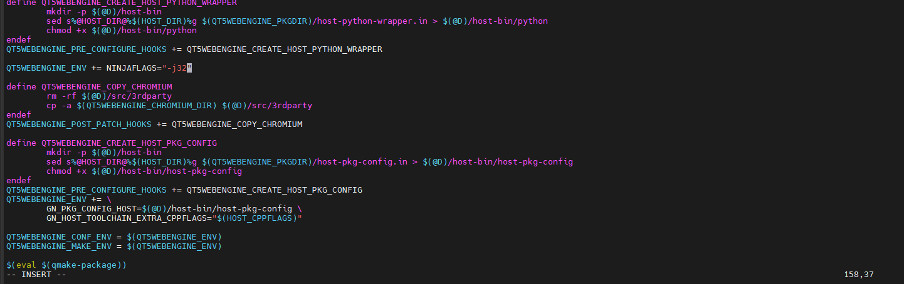

**继续执行build.sh进行编译即可**

源码编译完成后需要生成镜像，将编译生成的各种文件和配置文件进行打包。

执行打包命令生成镜像文件：

```plain
forlinx@ubuntu:~/work/OKT527-linux-sdk$ ./build.sh pack

…

Dragon execute image.cfg SUCCESS !
----------image is at----------

655M    ~/work/OKT527-linux-sdk/out/t527_linux_okt527_uart0.img

pack finish
```

### <font style="color:black;">4.2.2</font><font style="color:black;">  </font><font style="color:black;">单独编译内核</font><font style="color:black;">设备树</font>
单独编译内核只针对内核源码进行编译，影响驱动，适用于仅修改内核时进行编译。

按照前文方法选择配置后：

```plain
forlinx@ubuntu:~$ cd /home/forlinx/work/OKT527-linux-sdk
forlinx@ubuntu:~/work/OKT527-linux-sdk$ ./build.sh kernel                    //执行编译内核命令

…

Copy modules to target ...
15985 blocks
28830 blocks
bootimg_build
Copy boot.img to output directory ...

sun55iw3p1 compile all(Kernel+modules+boot.img) successful

…

forlinx@ubuntu:~/work/OKT527-linux-sdk$ ./build.sh pack
```

### <font style="color:black;">4.2.3</font><font style="color:black;">  </font><font style="color:black;">单独编译测试程序</font>
在单独修改测试程序时，可以只编译测试程序，减少编译量。

```plain
forlinx@ubuntu:~$ cd /home/forlinx/work/OKT527-linux-sdk
forlinx@ubuntu:~/work/OKT527-linux-sdk$ source .buildconfig              //进行编译前的配置
forlinx@ubuntu:~/work/OKT527-linux-sdk$ ./platform/forlinx/build.sh
```

### <font style="color:black;">4.2.4  单独编译uboot</font>
单独编译uboot使用如下命令。

```plain
forlinx@ubuntu:~/work/OKT527-linux-sdk$ ./build.sh brandy
forlinx@ubuntu:~/work/OKT527-linux-sdk$ ./build.sh pack
```

注：uboot内容不开源，单独编译时会报错，忽略即可。

### <font style="color:black;">4.2.5  单独编译文件系统</font>
全编译过程中是不会编译文件系统的，需要单独对文件系统进行修改和编译。我们进入到文件系统目录下，进行编译和配置修改。

编译指令如下，使用buildroot-202205下的编译脚本进行编译。

```bash
forlinx@ubuntu:~/work/OKT527-linux-sdk/buildroot/buildroot-202205$ ./build.sh
```

如果想修改配置，可按照如下方式修改。修改完成后使用上述指令编译。

```bash
forlinx@ubuntu:~/work/OKT527-linux-sdk/buildroot/buildroot-202205$ make OKT527-C-Linux_defconfig ARCH=arm64					//读取当前配置
forlinx@ubuntu:~/work/OKT527-linux-sdk/buildroot/buildroot-202205$ make menuconfig	//进入图形配置界面修改配置
forlinx@ubuntu:~/work/OKT527-linux-sdk/buildroot/buildroot-202205$ cp ../../out/t527/okt527/buildroot/buildroot/.config configs/OKT527-C-Linux_defconfig		//保存修改的内容为默认配置
```

### <font style="color:black;">4.2.6  清除OKT527-linux-sdk</font>
该操作清除所有中间文件。但不影响源文件，包括已经有改动的源文件。

```plain
forlinx@ubuntu:~$ cd /home/forlinx/work/OKT527-linux-sdk
forlinx@ubuntu:~/work/OKT527-linux-sdk$ ./build.sh clean                            //执行清除命令
```

### <font style="color:black;">4.2.7  更换启动 logo</font>
替换device/config/chips/t527/boot-resource/boot-resource/bootlogo.bmp

图片使用bmp格式，720x480分辨率，文件名为“bootlogo.bmp”。

重新打包镜像

```plain
forlinx@ubuntu:~/work/OKT527-linux-sdk$ ./build.sh pack
```

### <font style="color:black;">4.2.8 单独更新固件</font>
编译镜像后可以单独更新uboot、设备树和内核，从out/pack_out/中拷贝uboot、设备树文件boot_package.fex和内核文件boot.fex。

这里使用U盘测试，文件放在U盘中，挂载到/run/media/sda1/ 。也可以网口传输文件到开发板

uboot和设备树更新

```plain
dd if=/run/media/sda1/boot_package.fex of=/dev/mmcblk0 seek=32800
dd if=/run/media/sda1/boot_package.fex of=/dev/mmcblk0 seek=24576
```

内核更新

```plain
dd if=/run/media/sda1/boot.fex of=/dev/mmcblk0p3 conv=fsync
```

暂不支持文件系统整个更新，如有需要，可以U盘或者ssh传输所需的文件

## <font style="color:black;">4.3</font><font style="color:black;">  </font><font style="color:black;">Qt</font><font style="color:black;">配置及使用</font>
飞凌提供的OKT527-linux-sdk1.3.tar.bz2中提供了Qt5.15.8的完整开发依赖环境,我们的开发环境已经装好了Qt Creator5.12.9，请自行按照前文方法自行搭建Qt Creator5.15.8环境

### <font style="color:black;">4.3.1</font><font style="color:black;">  </font><font style="color:black;">安装</font><font style="color:black;">OKT527-linux-sdk</font>
请先参考第三章进行SDK的安装和全编译。

### <font style="color:black;">4.3.2</font><font style="color:black;">  </font><font style="color:black;">Qt Creator </font><font style="color:black;">环境</font><font style="color:black;">配置</font>
请先参考第三章进行安装和配置。

### <font style="color:black;">4.3.3</font><font style="color:black;">  </font><font style="color:black;">Qt Creator </font><font style="color:black;">开发示例</font>
打开Qt Creator软件。

```plain
forlinx@ubuntu:~$ cd /home/forlinx/Qt5.12.9/Tools/QtCreator/bin/
forlinx@ubuntu:~/qtcreator-4.7.0/bin$ sudo ./qtcreator
```

启动Qt Creator 程序，进入到Qt Creator界面，点击“File”-> “New File or Project”新建一个工程，选择“Application (Qt)”->“Qt Widgets Application”，然后点击右下角的“Choose”：

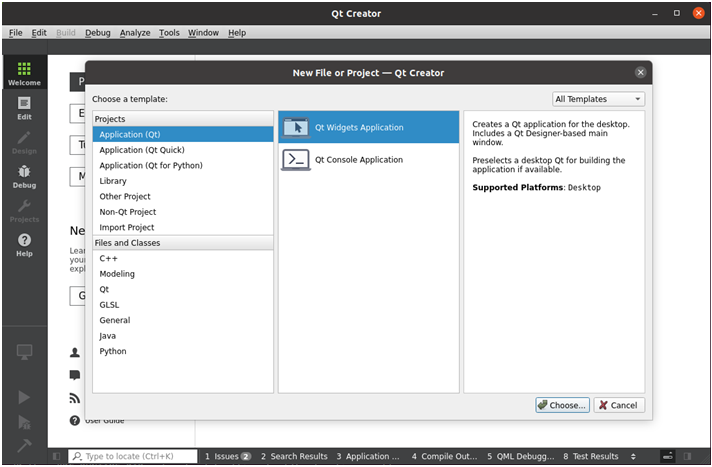

在如下界面中为新建的工程修改名字为“helloworld”，选择安装路径选择/home/forlinx，然后点击“Next”：

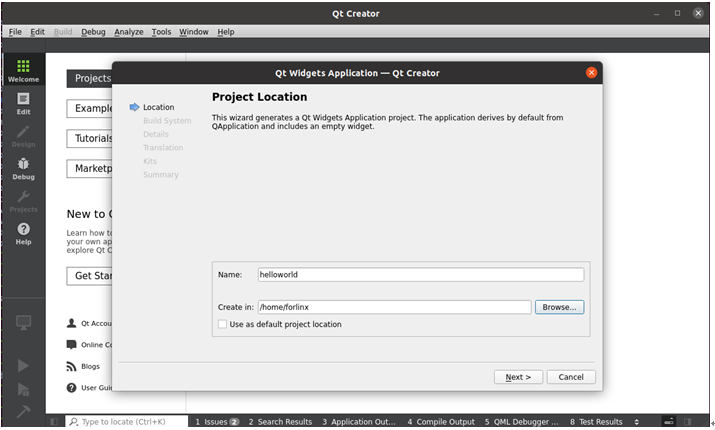

选择qmake,点击Next继续。

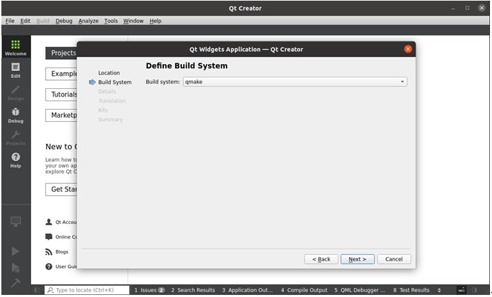

在如下界面中，可以按需求修改Class name 和Base class，这里使用默认，然后点击“Next”：

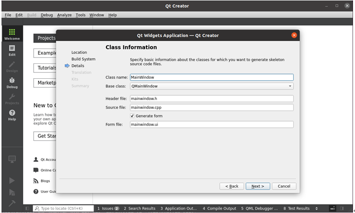

可以选择翻译文件，如果有对多语言支持的需求，可以选择语言。这里使用默认 点击Next

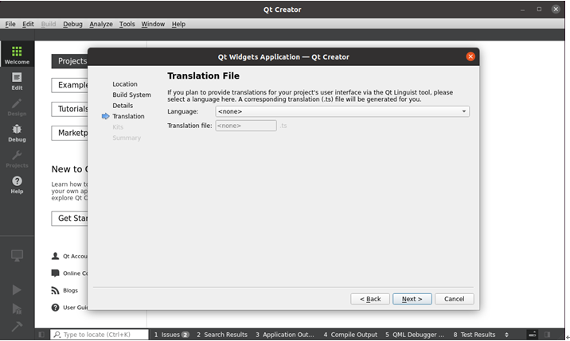

在如下界面中，选择之前已添加过的“OK527”作为当前工程的kit，然后点击“Next”：

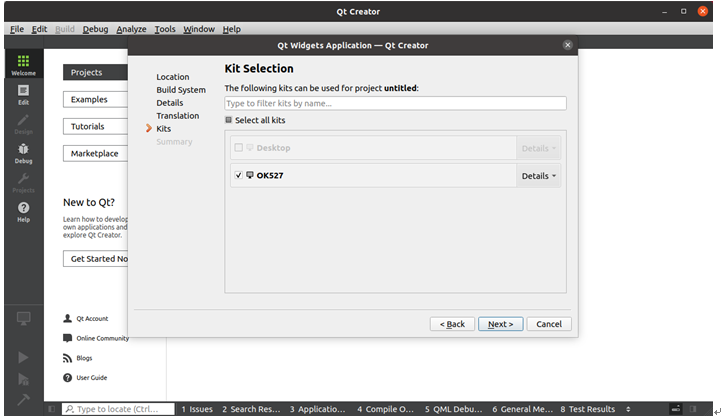

在如下界面中，点击“Finish”，完成工程的新建：

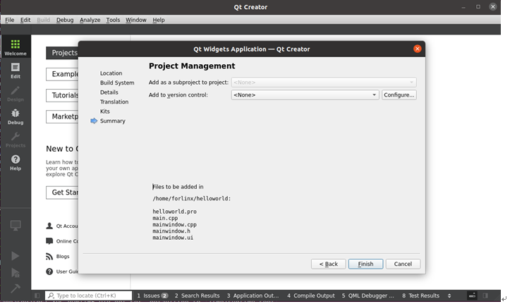

新建工程创建完成，即可显示如下窗口：

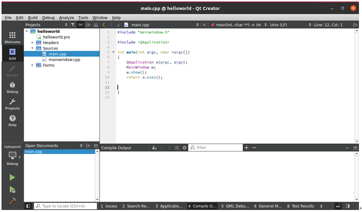

当程序编写完成后，点击左下角的锤子图标，即可进行交叉编译，将编译好的可执行程序拷贝到开发板，即可进行应用的测试。

### <font style="color:black;">4.3.4 </font><font style="color:black;"> </font><font style="color:black;">Qt Creator </font><font style="color:black;">常见问题及解决方法</font>
Ø  从命令行或者快捷方式打开 QtCreator 集成开发环境，启动之后看到类似下面的界面

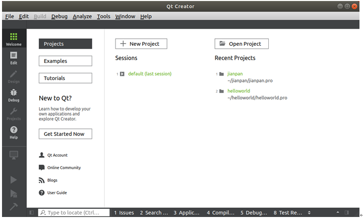

左边的设计按钮、项目按钮和构建调试区只有在打开或新建了项目之后才会变得可用。

QtCreator 下方的是定位工具和输出面板，在编写项目代码和运行、调试程序时会使用到。输出面板包括七个，分别是问题（项目构建时的问题）、Search Results（搜索项目文件内容）、应用程序输出（运行和调试信息显示）、编译输出（编译、链接命令及其输出信息）、QML/JS Console（QML 命令窗口）、概要信息（项目信息摘要）、Version Control（版本控制系统）。

1. 点击左下角锤子的按键，发现没有编译信息，解决方法如下：

我们默认输出面板选择的是1问题（Issues)，如果您需要查看编译信息，您需要在输出面板位置选择4编译输出（compile output) 。

Ø   构建调试

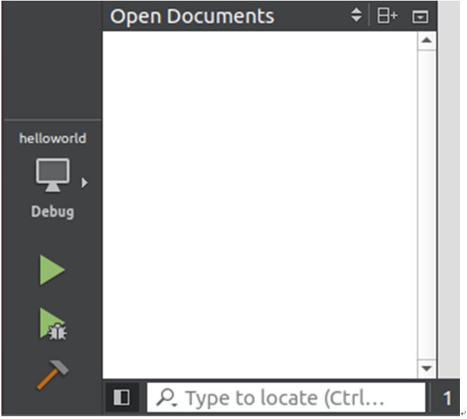

2.qtcreator调试运行按钮是灰色解决方法如下：

出现这个问题，是因为kits套件中配置C,C++和Qt version时出现了问题，可能是路径有问题，可能是您没有进行过全编译，修改编辑器语言即可。

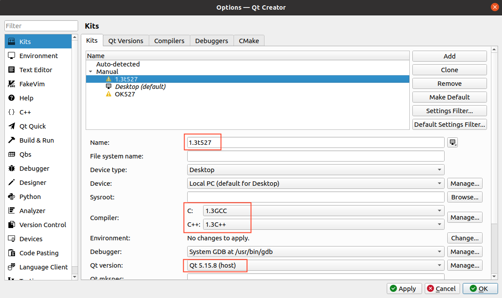

检查方框中的交叉编译器路径配置是否正确。

我们配置的路径具体配置方法参考[3.4  Qt编译环境的配置](https://forlinx-book.yuque.com/pxh4d1/xrit1g/4065557d050f94a9c309bdd354805839#KyF8n)章节。

