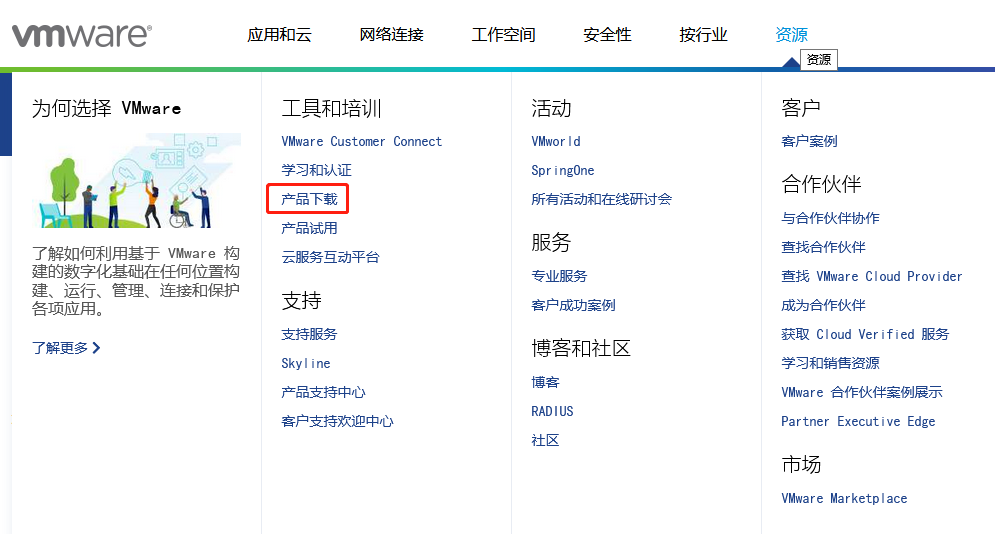
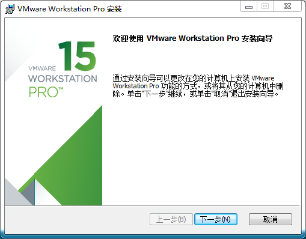
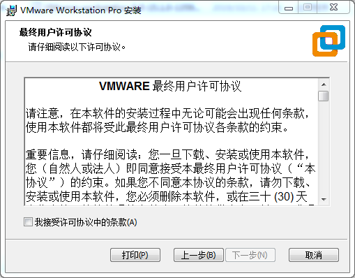
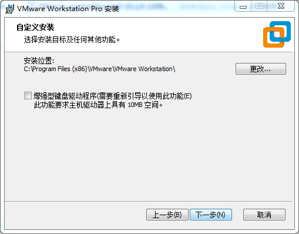
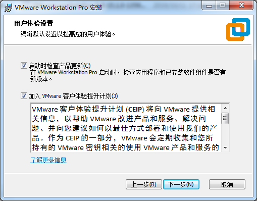
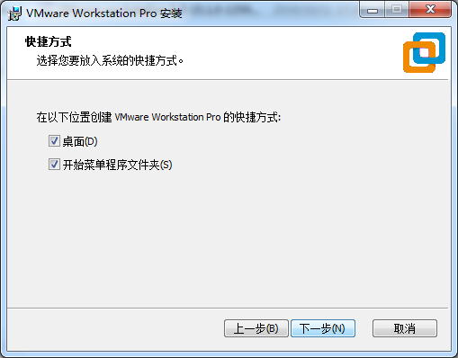
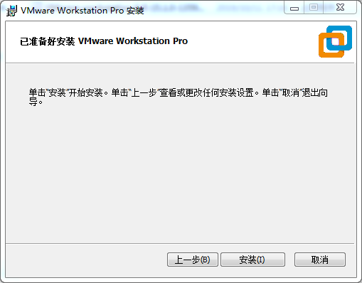
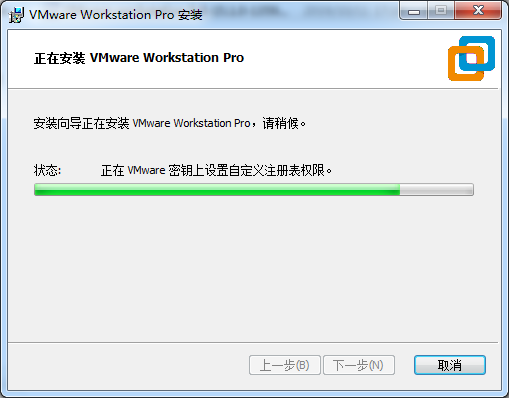
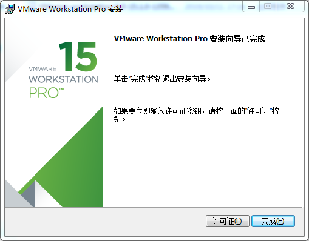

# 第一章 VMware虚拟机软件安装
本章主要介绍VMware虚拟机的安装，以VMware workstation 15 Pro v15.1.0为例展示操作系统的安装配置过程。

## 1.1 VMware软件的下载与购买
[登陆VMware官网https://www.vmware.com/cn.h](https://www.vmware.com/cn.html)tml下载Workstation Pro并获取产品密匙。VMware是付费软件，需要自行购买，或者使用VMware提供的试用版本。

等待下载完成后双击启动文件启动安装程序。

## 1.2 VMware软件的安装
双击启动程序进入安装向导。

点击“下一步”。

勾选我接受许可协议中的条款，点击“下一步”。

修改安装位置，装到自己电脑安装软件的分区，点击“下一步”。

勾选，点击“下一步”。

勾选添加快捷方式，点击“下一步”。

点击“安装”。

等待安装完成。

点击完成后可进行试用。若用户需要长期使用，需要到官方购买，填写许可证。

