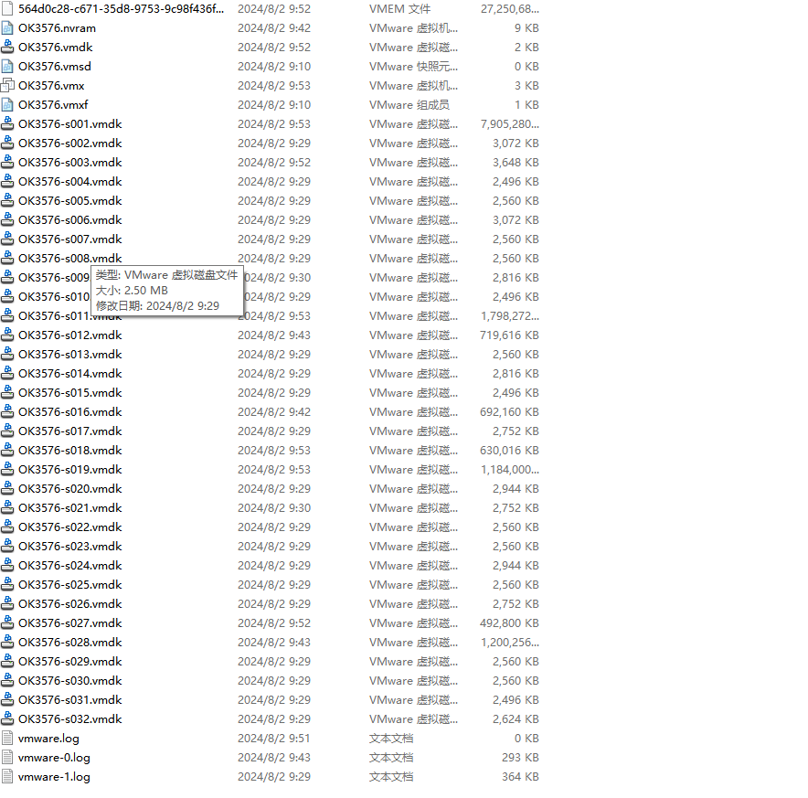
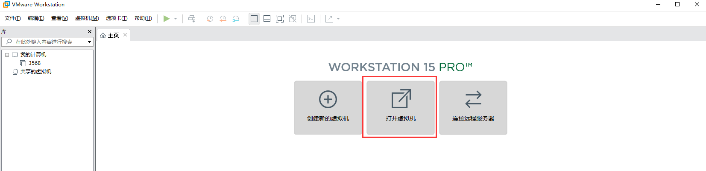
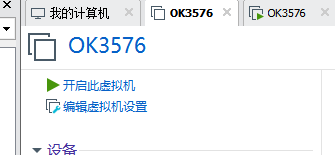
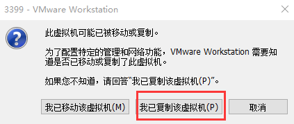
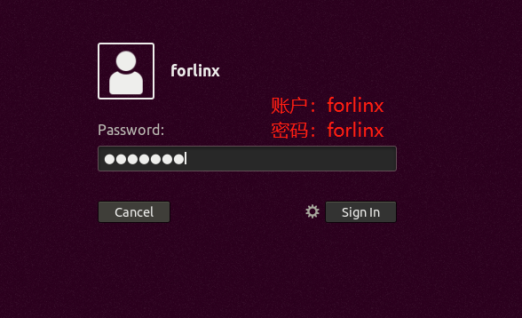
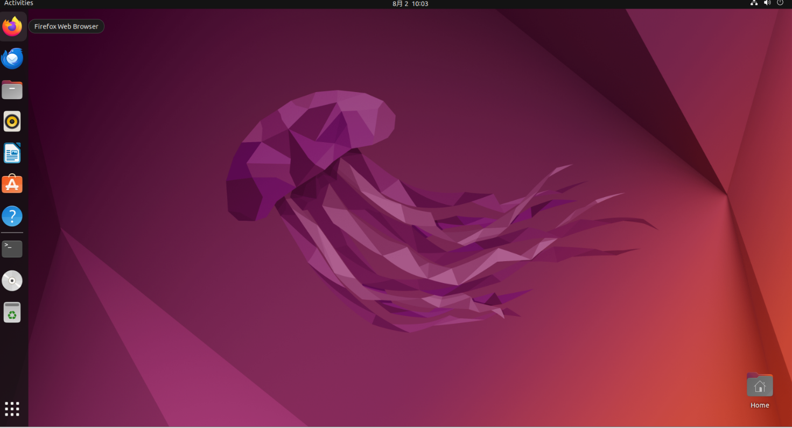

# 第二章 加载已有ubuntu开发环境
+ **注意：**
+ **建议初学者直接使用飞凌搭建好的虚拟机环境。了解完该章节后可以直接跳转到编译章节。**
+ **提供开发环境的账户为：forlinx，密码为：forlinx**

在VMware下使用虚拟机的环境有两种方式，一种是直接加载已有的环境，另一种是新建一个环境，我们先来说说如何加载一个已经存在的环境

首先，下载飞凌提供的开发环境，开发环境资料中有MD5校验文件，用户下载完开发环境资料，先对开发环境压缩包进行MD5校验（MD5校验可以在网络上选择MD5在线工具校验，也可以下载MD5校验工具进行校验，可根据实际情况选择），查看校验码和校验文件中校验码是否一致，若一致则下载文件正常；若不一致，则文件可能有破损，需要重新下载。

选中压缩包一起解压

解压完成后出现 3576标准环境文件夹，其中.vmx为虚拟机要打开的文件。

打开虚拟机，选择解压出来的OK3576.vmx

加载完成后点击开启此虚拟机，即可运行，进入系统的界面。

	提供开发环境的账户为forlinx，密码为forlinx，填好密码后选择Sign in登录。

